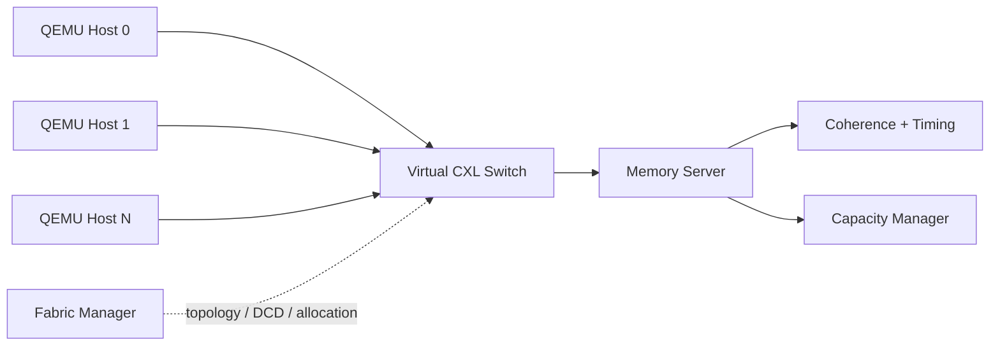
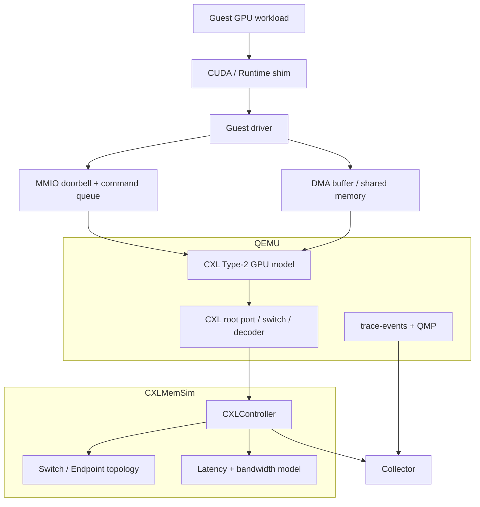
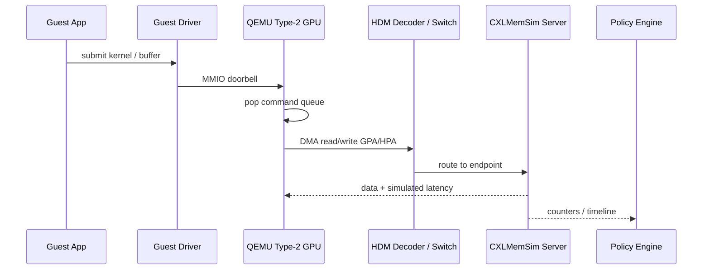
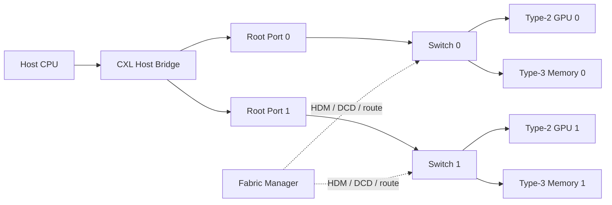
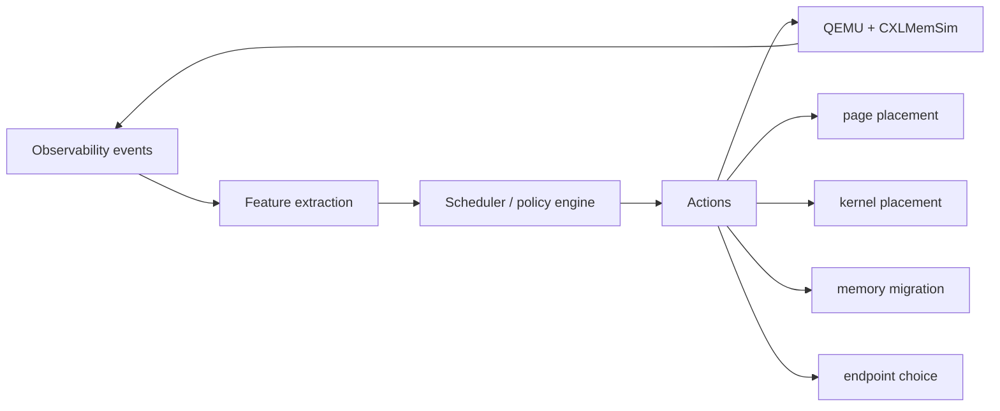

# 基于 CXLMemSim 和 QEMU 的 GPU 可观测系统构建

QEMU Camp Tutorial · GPU / CXL / Observability

讲解目标：借鉴 OCEAN 的多 CXL emulation 思路，用 QEMU + CXLMemSim 构建一个能观察 GPU 访存、CXL 拓扑、内存延迟与调度决策的实验系统。

## 1. 今天要解决的问题

GPU 系统的瓶颈正在从“算力是否足够”转向“数据是否放对”：

- HBM 很快但容量有限，CPU DRAM 容量较大但不在 GPU 旁边。
- CXL memory pool 可以扩展容量，但会引入 topology、coherence、latency、bandwidth 问题。
- 调度器如果只看平均带宽，就会错过 kernel phase、page placement、endpoint contention。

**核心命题：GPU 可观测性必须跨越 runtime、driver、QEMU device model、CXL fabric 和 memory simulator。**

---

## 2. 为什么现在做这件事

从 OCEAN draft 的动机看，CXL 研究卡在三类缺口上：

| 缺口 | 含义 | 对 GPU/CXL 实验的影响 |
|------|------|------------------------|
| Hardware gap | 多 host CXL 3.0 硬件还不普及 | 很难复现 fabric-level 行为 |
| Software gap | 应用仍假设私有内存或 message passing | 很难知道 shared pool 对 workload 是否有利 |
| Scale gap | 单 host 工具看不到跨 host/fabric 行为 | 很难研究 switch、coherence、DCD、pooling |

QEMU + CXLMemSim 的价值是：先把系统语义做出来，让 workload 在可控环境里暴露行为。

---

## 3. Observability 的 first principles

可观测系统不是“多打日志”，而是回答三个问题：

| 问题 | 系统含义 | GPU/CXL 例子 |
|------|----------|--------------|
| What happened? | 发生了什么事件 | GPU DMA 读了一个 CXL memory page |
| Where did it happen? | 事件在拓扑哪里发生 | Host Bridge → Switch 0 → Endpoint 1 |
| Why did it matter? | 对性能或正确性有什么影响 | remote latency 让 kernel stall |

因此插桩点要放在**语义产生的位置**：MMIO doorbell、DMA path、HDM decode、switch route、memory endpoint、scheduler action。

---

## 4. CXL 最小背景

CXL 建在 PCIe 物理层之上，增加了内存和一致性语义：

- **CXL.io**：设备枚举、配置空间、MMIO、mailbox。
- **CXL.cache**：设备缓存 host memory，参与一致性。
- **CXL.mem**：host 以 load/store 访问 device-attached memory。

设备类型：

- **Type-1**：无本地内存的 accelerator，偏 CXL.cache。
- **Type-2**：有本地内存的 accelerator，适合表达 GPU/AI accelerator。
- **Type-3**：memory expander，提供 CXL.mem 容量扩展。

---

## 5. CXL 3.0：从单设备到 Fabric

OCEAN draft 强调的三个 CXL 3.0 能力很适合做多 CXL 教学主线：

| 能力 | 直觉 | 对实验的意义 |
|------|------|--------------|
| GFAM | fabric 上的 shared global memory pool | 多 host 共享同一段 memory |
| MH-SLD | 一个逻辑设备服务多个 host | 研究 access control 和 region isolation |
| DCD | 运行时动态增减 capacity | 做 hot-add/hot-remove 和 elastic memory |

这让 CXL 从“主机挂一个设备”变成“host、switch、memory、accelerator 组成 fabric”。

---

## 6. OCEAN 参考模型：我们借鉴什么



我们不把 CXLMemSim 说成 OCEAN，而是借鉴它的结构清单：

- QEMU full-system host + Linux CXL stack
- virtual switch + Fabric Manager 思路
- HDM decoder / address mapping
- memory server 的 coherence、timing、bandwidth、capacity 模型

---

## 7. GPU 为什么适合建成 CXL Type-2

GPU 既是计算设备，也是内存系统参与者：

- CPU 通过 command queue / doorbell 调度 GPU kernel。
- GPU 通过 DMA 读写 host buffer、CXL memory、device memory。
- kernel 的 read/write ratio 会直接影响远端内存收益。
- 多 GPU 或多 host 场景中，coherence 与 placement 影响 tail latency。


---

## 8. 目标系统架构



QEMU 负责“硬件语义”，CXLMemSim 负责“内存行为”，collector 负责“跨层因果链”。

---

## 9. 可观测对象：到底采什么

| 层次 | 事件 | 关键字段 |
|------|------|----------|
| Runtime | kernel launch、memcpy、sync | pid、stream、kernel id、buffer id |
| Driver | ioctl、MMIO、DMA mapping | command id、BAR、GPA、size |
| QEMU GPU | doorbell、queue pop、DMA read/write | device id、opcode、addr、len |
| CXL fabric | decoder hit、switch route、endpoint access | host、switch、endpoint、protocol |
| CXLMemSim | local/remote/HITM、latency | page id、op type、counter、policy tag |
| Scheduler | placement、migration、route choice | before/after、reason、cost model |

最终目标不是“事件越多越好”，而是能解释：kernel 为什么慢，内存为什么远，调度为什么这样做。

---

## 10. 一次访问的端到端路径

借鉴 OCEAN 的 datapath，把一次访问拆成六段：



关键点：guest 看到的不只是 trace，而是 QEMU/CXLMemSim 注入后的 timing effect。

---

## 11. QEMU 插桩点

QEMU 中最有价值的观测位置：

- **MemoryRegionOps**：MMIO read/write，看到寄存器语义。
- **command queue**：看到 GPU kernel、copy、sync 的设备级命令。
- **DMA path**：看到设备如何访问 guest memory。
- **CXL decoder / switch path**：看到地址如何落到 endpoint。
- **trace-events + QMP**：外部 collector 可以低侵入订阅。

```c {data-ppt-lines="12"}
static void cxl_gpu_mmio_write(void *opaque, hwaddr addr,
                               uint64_t val, unsigned size)
{
    CXLType2GPU *gpu = opaque;
    trace_cxl_gpu_mmio_write(gpu->dev_id, addr, val, size);
    cxl_gpu_dispatch_command(gpu, addr, val);
}
```

---

## 12. Memory server：coherence + timing

OCEAN draft 里最重要的提醒是：多 host CXL 难点不只是“能发 remote load”，而是“正确且可扩展地维护一致性和时序”。

在 CXLMemSim/QEMU 版里，对应能力可以拆成：

- **Directory/MESI 思路**：记录 owner、sharer、dirty state。
- **Snoop / invalidation counter**：记录 invalidation、downgrade、back-invalidation。
- **Active latency injection**：让 guest 或 device thread 看到模拟延迟。
- **Bandwidth cap**：用 token bucket 表达 endpoint/switch 带宽上限。
- **Transport abstraction**：本机可用 SHM，跨节点可映射到 TCP/RDMA 风格。

Timing 口径：`Tstall = max(0, Tsim - Ttransport)`。

---

## 13. 统一事件 schema

所有层统一成一个 envelope，collector 才能做 join：

```json {data-ppt-lines="16"}
{
  "ts_ns": 1779403429000000000,
  "layer": "qemu.cxl.type2",
  "source": "gpu0",
  "event": "dma_read",
  "addr": "0x40800000",
  "size": 4096,
  "op": "load",
  "context": {
    "pid": 1234,
    "kernel": "attention_prefill",
    "switch": 0,
    "endpoint": 1,
    "policy": "near_gpu"
  }
}
```

字段设计要稳定，因为后面调度器、dashboard、论文图都依赖它。

---

## 14. 多 CXL 拓扑如何影响性能



性能差异通常来自：hop count、switch contention、endpoint bandwidth、coherence sharer set、HDM decoder placement。

---

## 15. 调度闭环：从观测到决策



调度器需要的 feature：

- read/write ratio 和 working-set phase
- local/remote page ratio
- endpoint bandwidth 与 queue depth
- invalidation/downgrade signal
- DCD capacity change 与 page migration cost

---

## 16. 构建步骤：最小实验环境

推荐按四层验证：

1. 构建 QEMU：确认 PCIe/CXL 设备模型能枚举。
2. 启动 Guest：确认 Linux 能看到 CXL root、endpoint、NUMA node。
3. 启动 CXLMemSim：确认 controller counter 随 workload 变化。
4. 打开 collector：确认 runtime marker、QEMU trace、CXLMemSim stats 能对齐。

```bash
cmake -S . -B build -DCMAKE_BUILD_TYPE=RelWithDebInfo
cmake --build build -j

./bin/cxlmemsim_server --config configs/cxl-type2-gpu.json
./bin/qemu_launch_cxl.sh
```

---

## 17. Demo 1：单 GPU + 单 CXL Memory

目标：证明一条端到端事件链能闭合。


观察点：

- GPU kernel launch 是否能关联到 MMIO doorbell。
- DMA read/write 是否能关联到 GPA/HPA 和 page id。
- CXLMemSim local/remote counter 是否与 workload 的读写比例匹配。
- completion interrupt 是否能闭合一次 command timeline。

---

## 18. Demo 2：多 CXL Fabric

这页对应 OCEAN hands-on 的三个实验动作：

| Lab | 操作 | 要解释的现象 |
|-----|------|--------------|
| Inspect topology | 看 HDM decoder、switch port、endpoint | 地址如何映射到设备 |
| Trace one access | 跟踪一次 coherent read/write | ownership、sharer、stall 从哪里来 |
| Change policy | 改 latency、bandwidth、placement | topology/policy 如何改变性能 |

对 GPU 场景，演示重点是：同一个 kernel 在不同 endpoint placement 下，local/remote ratio 和 tail latency 如何变化。

---

## 19. Debug：常见失败模式

| 现象 | 可能原因 | 检查点 |
|------|----------|--------|
| Guest 没有网卡 | QEMU 未启用 user/slirp 或设备名不一致 | `qemu-system-* -netdev help`、`ip -br a` |
| CXL NUMA service 失败 | region、decoder、nmem 状态未就绪 | `cxl list`、`dmesg`、`systemctl status` |
| counter 全是 0 | workload 没走到 CXLMemSim path | MMIO trace、DMA trace、server log |
| remote 永远为 0 | page placement 或 HDM range 没映射到 remote | controller config、decoder range |
| latency 不变 | 没有在 guest/device path 注入 stall | timing hook、transport baseline |

Debug 顺序：先枚举，再 MMIO，再 DMA，再 decoder route，最后看 scheduler。

---

## 20. Takeaways

GPU 可观测系统的核心是一条跨层因果链：

```text
workload phase
  -> runtime command
  -> QEMU device action
  -> CXL decoder / switch route
  -> memory endpoint behavior
  -> scheduler decision
```

OCEAN 给了多 host CXL emulation 的参考形状：QEMU host、Linux CXL stack、virtual switch、Fabric Manager、memory server、coherence、active timing。我们在 CXLMemSim + QEMU 里借这条主线，把 GPU Type-2 设备和调度可观测性做成可复现的教程实验。

下一步：让每个 workload 自动产出 topology timeline、counter table、latency breakdown 和 scheduler decision log。
